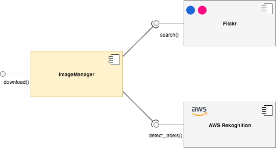

# Overview

Library to download images from Flickr and search for words with AWS Rekognition.  The library includes a class named `ImageManager` that exposes a method named `download()`.  The method takes a search term, performs a search on Flickr for images with the term and then downloads the images.  The images are then uploaded to AWS Rekognition to detect labels in the images.  Finally, an HTML report is generated in the current directory, named `report.html` with the findings.

# Development
To develop locally, you will need the following prerequisites:

* Python >= 3.6
* Flickr [API key](https://www.flickr.com/services/apps/create/noncommercial/) 

Next, install dependencies with `pip install -e requirements.txt`.  Update the Flickr API keys in the ImageManager class.  Finally, run the tests via `python test_imagemanager.py`.